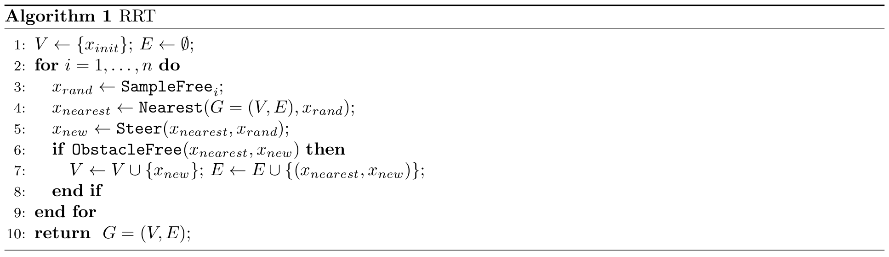

# Motion planning using RRT* to avoid obstacles

### RRT Pseudocode

### F1TENTH RRT vs. Generic RRT

In general, RRT is often used as a global planner where the tree is kept throughout the time steps. Whenever there is a new obstacle, and the occupancy grid changes, the tree will change accordingly. In our case, RRT is used as a local planner for obstacle avoidance. This is due to the fact that we don't have a well-defined starting point and goal point when we're racing on a track and we want to run continuous laps. In our implementation, we are only keeping a tree for the current time step in an area around the car.

### Important steps implemented for RRT*
- Local occupancy grid computation using LIDAR scans
- RRT* for finding an obstacle free path to the goal.
  - Efficiently sampling in the direction of the goal point.
- Further pruning the path and choosing a suitable waypoint to follow.
- Pure pursuit controlller on the chosen waypoint.

### Youtube video links
 - [Basic RRT working on Simulator](https://youtu.be/ZJQH1_YIZVs)  
 - [RRT* Working on Simulator - without tree visualization](https://youtu.be/ragM_NNj69o)  
 - [RRT* Working on Simulator - with tree visualization](https://youtu.be/XVz7nyZut30)
 - [RRT* Working on the real car](https://youtube.com/shorts/AR6vk_OLl9Y?feature=share)  

### Real car video

### Simulation video
